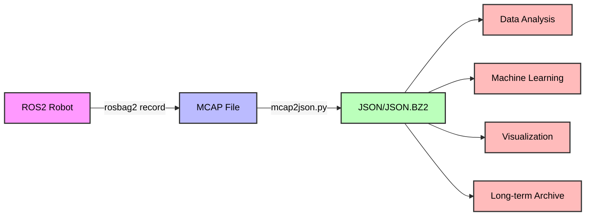

# MCAP to JSON Converter for ROS2

## Overview

A Python tool to convert ROS2 MCAP rosbag files to JSON format, with support for topic filtering, compression, and progress tracking.
The primary motivation for this tool is to **decouple data processing from the ROS2 stack**.

### Benefits

- **No ROS2 Dependencies**: Once converted, you can process your robotics data using any programming language or tool that can read JSON, without needing ROS2 installed
- **Simplified Pipeline**: Data scientists and analysts can work with familiar JSON tools instead of learning ROS2-specific APIs
- **Cross-Platform Processing**: JSON files can be processed on any system, regardless of ROS2 compatibility
- **Standard Tooling**: Leverage existing JSON ecosystem tools (jq, grep, Python, pandas, etc.) for data analysis
- **Long-term Storage**: JSON is a stable, human-readable format that will remain accessible long after specific ROS2 versions become obsolete

### Features

- **JSON Line Format**: Outputs one JSON object per line for easy streaming and processing
- **Topic Filtering**: Select specific topics to convert
- **Automatic Compression**: Built-in bzip2 compression for output files
- **Progress Bar**: Visual progress indicator during conversion
- **Message Decoding**: Automatically decodes standard ROS2 messages (geometry_msgs, sensor_msgs, etc.)
- **Fallback Support**: Outputs raw base64-encoded data for custom messages that cannot be decoded
- **Schema Information**: Preserves message type and encoding information for all messages

### Command-Line Options

```
usage: mcap2json.py [-h] -m MCAP [-o JSON_FILE] [-q] [-p] [-l] [topics ...]

Convert ROS2 MCAP rosbag to JSON format (one object per line)

positional arguments:
  topics                Topics to include in output (if not specified, all topics are included)

options:
  -h, --help            show this help message and exit
  -m MCAP, --mcap MCAP  Path to the MCAP file to convert
  -o JSON_FILE, --output JSON_FILE
                        Path to output JSON file (defaults to stdout if not specified). 
                        If filename ends with .bz2, output will be compressed with bzip2
  -q, --no-progress     Disable progress bar (quiet mode)
  -p, --pretty          Pretty-print JSON output (indented format)
  -l, --list-topics     List all topics with their types and message counts, then exit
```

### Performance Tips

1. **Use Compression**: For large conversions, use `.bz2` output option to save disk space
2. **Topic Filtering**: Filter topics during conversion rather than post-processing
3. **Streaming**: The line-by-line JSON format allows for efficient streaming processing


## Usage

The typical workflow is:



After conversion, no ROS2 dependencies are required for any downstream processing!


### Basic Usage

Convert all messages from an MCAP file to stdout:

```bash
python3 mcap2json.py -m input.mcap
```

### Save to File

Convert and save to a JSON file:

```bash
python3 mcap2json.py -m input.mcap -o output.json
```

### Compressed Output

Automatically compress output by using `.bz2` extension:

```bash
python3 mcap2json.py -m input.mcap -o output.json.bz2
```

### Topic Filtering

Convert only specific topics:

```bash
# Single topic
python3 mcap2json.py -m input.mcap -o output.json /tf

# Multiple topics
python3 mcap2json.py -m input.mcap -o output.json /tf /odometry /scan

# Topics with compressed output
python3 mcap2json.py -m input.mcap -o output.json.bz2 /cmd_vel /imu/data
```

### Disable Progress Bar

Use quiet mode to disable the progress bar:

```bash
python3 mcap2json.py -m input.mcap -o output.json -q
```

### Pretty-Print Output

Enable pretty-printing for human-readable JSON (not recommended for large files):

```bash
python3 mcap2json.py -m input.mcap -o output.json -p
```

### List Topics

List all topics in the MCAP file with their types and message counts:

```bash
python3 mcap2json.py -m input.mcap -l
```

Example output:
```
Topic                                              Type                                              Count
----------------------------------------------------------------------------------------------------------------
/cmd_vel                                           geometry_msgs/msg/Twist                              1520
/odometry                                          nav_msgs/msg/Odometry                                3048
/scan                                              sensor_msgs/msg/LaserScan                            762
/tf                                                tf2_msgs/msg/TFMessage                               6096
----------------------------------------------------------------------------------------------------------------
Total                                                                                                  11426
```

## Output Format

Each line in the output contains a JSON object with the following fields:

```json
{
  "topic": "/scan",
  "timestamp": 1234567890123456789,
  "message_type": "sensor_msgs/msg/LaserScan",
  "data": {
    "header": {
      "stamp": {"sec": 1234567890, "nanosec": 123456789},
      "frame_id": "laser_frame"
    },
    "angle_min": -1.57,
    "angle_max": 1.57,
    "ranges": [0.5, 0.6, 0.7, ...]
  }
}
```

For messages that cannot be decoded:

```json
{
  "topic": "/unknown_topic",
  "timestamp": 1234567890123456789,
  "message_type": "unknown",
  "data": {"raw_data": "base64encodeddata..."},
  "encoding": "cdr",
  "decode_error": "Decoder not found for message type"
}
```

## Analyzing Compressed Output

### Using bzcat and grep

Search for specific message types in compressed files:

```bash
# Find all LaserScan messages
bzcat output.json.bz2 | grep '"message_type": "sensor_msgs/msg/LaserScan"'

# Count messages by type
bzcat output.json.bz2 | grep -o '"message_type": "[^"]*"' | sort | uniq -c

# Find messages from a specific topic
bzcat output.json.bz2 | grep '"topic": "/scan"'
```

### Using jq for JSON Processing

Extract specific fields from compressed data:

```bash
# Get all unique topics
bzcat output.json.bz2 | jq -r '.topic' | sort | uniq

# Extract timestamps and topics
bzcat output.json.bz2 | jq -r '[.timestamp, .topic] | @csv'

# Filter messages by timestamp range
bzcat output.json.bz2 | jq 'select(.timestamp > 1234567890000000000 and .timestamp < 1234567900000000000)'
```

## License

Copyright (c) 2024 Milosch Meriac <milosch@meriac.com>

Licensed under the Apache License, Version 2.0

This file was written with the assistance of Claude.ai