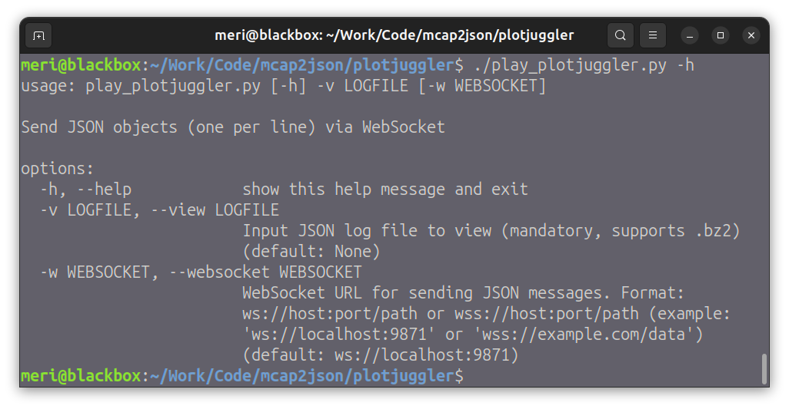
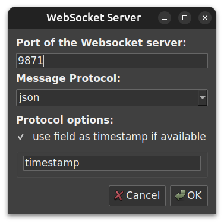

# PlotJuggler WebSocket JSON Streamer

A Python tool for streaming JSON-formatted ROS2 bag data via WebSocket connections, designed for real-time data visualization and analysis.

## Overview

`play_plotjuggler.py` processes JSON log files (including compressed `.bz2` files) and streams them via WebSocket to visualization tools or data consumers. It automatically handles ROS2 message formatting and timestamp conversion.

## Features

- **WebSocket streaming**: Send JSON messages over WebSocket protocol
- **Compressed file support**: Automatically handles `.bz2` compressed files
- **ROS2 message handling**: Converts ROS2 timestamps and nests data by topic path
- **Flexible output**: Can output to stdout if no WebSocket URL is provided
- **Async operation**: Efficient asynchronous WebSocket communication

## Quick Start

```bash
# Clone the repository
git clone https://github.com/yourusername/mcap2json.git
cd mcap2json/plotjuggler

# Create and activate virtual environment
python3 -m venv venv
source venv/bin/activate  # Linux/macOS

# Install dependencies
pip install -r requirements.txt

# Run the application
./play_plotjuggler.py -v sample_data.json -w ws://localhost:9871
```

## Usage

### Command Line Arguments

| Argument | Short | Required | Default | Description |
|----------|-------|----------|---------|-------------|
| `--view` | `-v` | Yes | - | Input JSON log file (supports `.bz2` compression) |
| `--websocket` | `-w` | No | `ws://localhost:9871` | WebSocket URL for sending messages |



### Examples

#### Stream to default WebSocket server
```bash
./play_plotjuggler.py -v ros2_data.json
```

#### Stream compressed file to custom WebSocket URL
```bash
./play_plotjuggler.py -v ros2_data.json.bz2 -w ws://192.168.1.100:8080
```

#### Use secure WebSocket connection
```bash
./play_plotjuggler.py -v ros2_data.json -w wss://secure.example.com/data
```

#### Output to stdout (no WebSocket)
```bash
./play_plotjuggler.py -v ros2_data.json -w ""
```

## WebSocket URL Format

The WebSocket URL supports the following formats:
- `ws://host:port` - Unsecured WebSocket
- `wss://host:port` - Secure WebSocket (TLS)
- `ws://host:port/path` - WebSocket with path
- `host:port` - Automatically prepends `ws://`

## Data Format

### Input Format

The tool expects JSON objects, one per line, with the following structure for ROS2 messages:

```json
{
  "topic": "/sensor/data",
  "timestamp": 1234567890123456789,
  "data": {
    "field1": "value1",
    "field2": 123.45
  }
}
```

### Output Format

For ROS2 messages, the tool:
1. Converts timestamps from nanoseconds to seconds
2. Nests data under the topic path hierarchy

Example output:
```json
{
  "topic": "/sensor/data",
  "timestamp": 1234567890.123456789,
  "sensor": {
    "data": {
      "field1": "value1",
      "field2": 123.45
    }
  }
}
```

## Integration with PlotJuggler

This tool is designed to work with PlotJuggler's WebSocket data source plugin:

1. Start PlotJuggler
2. Select "WebSocket" as data source
3. Configure the WebSocket server settings (default: `ws://localhost:9871`)
4. Run this script to stream data to PlotJuggler



## Performance Considerations

- Uses asynchronous I/O for efficient WebSocket communication
- Processes files line-by-line to handle large datasets
- Automatically handles bzip2 decompression without loading entire file

## License

Licensed under the Apache License, Version 2.0. See the source file for full license text.
